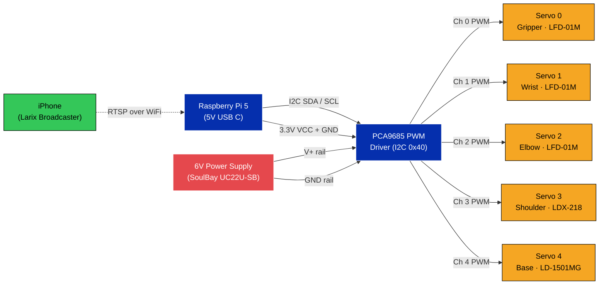
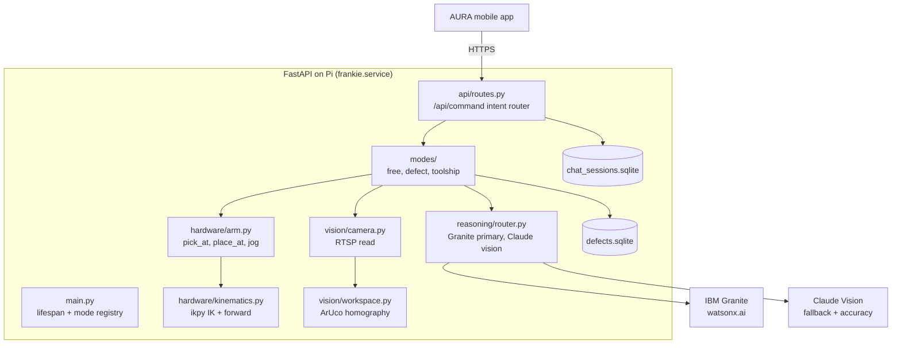

# Frankie

**F**ramework for **R**obotic **A**ssistance, **N**etworked **K**nowledge, **I**ntelligent **E**ngineering.

The reference robotic apprentice for the [AURA](https://github.com/sudarshan-sridhar/aura) mobile app. A 5 DOF arm on a Raspberry Pi 5 with an iPhone camera, total hardware under $1,000.


---

## What Frankie does

| | |
|---|---|
|  | Conversational floor presence. Multi joint canned gestures (wave, nod, bow, point, look, shrug, head shake) trigger from Frankie's own spoken reply, so body language follows the words. |
|  | Show Frankie a defective part and say why. It captures the HSV signature plus the spoken reason and stores it. Later, when multiple parts are on the bench, Frankie picks the matching part and drops it in the reject zone. |
|  | Ask for a tool by name. Frankie picks it from the workspace by color signature, lifts to a safe transit height, and delivers it with the senior machinist's warning. |
|  | Every joint exposed via REST. The AURA mobile app jogs joints, opens or closes the gripper, sends Home, and triggers E stop. |
|  | iPhone broadcasts RTSP to MediaMTX on the Pi. OpenCV reads frames, ArUco markers define the workspace homography. |

---

## Hardware

| Component | Spec |
|---|---|
| Compute | Raspberry Pi 5 (4 GB), 27W USB C PSU |
| Servo driver | PCA9685 16 channel PWM, I2C bus 1 (`0x40`) |
| Joints | 5 servos (gripper + wrist + elbow + shoulder + base) |
| Power rail | Single 6V from SoulBay UC22U-SB, separate 5V USB C for Pi |
| Camera | iPhone running Larix Broadcaster, RTSP push to Pi |
| RTSP relay | MediaMTX (systemd service on Pi, listens on `:8554`) |
| Workspace | 4 ArUco markers (DICT_4X4_50, IDs 0 to 3) on a cardboard rectangle |

### Servo channel map

| Channel | Joint | Motor model |
|---|---|---|
| 0 | gripper | LFD-01M |
| 1 | wrist | LFD-01M |
| 2 | elbow | LFD-01M |
| 3 | shoulder | LDX-218 |
| 4 | base | LD-1501MG |

### Circuit diagram



**Wiring notes:**
- The PCA9685 needs both the Pi's 3.3V logic VCC (for the I2C transceiver) and the external 6V on V+ (to drive the servos). Tie all grounds together.
- The base servo (LD-1501MG) draws up to 2A under stall. Size the 6V supply accordingly.
- Keep servo wires short. Long runs introduce timing noise that shows up as twitchy joints.

---

## Software architecture



---

## Key endpoints

| Method | Path | Purpose |
|---|---|---|
| GET | `/health` | liveness + feature flags |
| GET | `/api/modes` | available + active modes |
| POST | `/api/mode/{name}` | switch mode |
| POST | `/api/command` | natural language dispatch (intent router auto switches modes per turn) |
| POST | `/api/voice` | Whisper STT proxy |
| GET | `/api/camera/stream` | HTTP MJPEG (mobile WebView friendly) |
| GET | `/api/camera/snapshot` | one JPEG |
| POST | `/api/calibrate_all` | detect ArUco markers + rebuild homography |
| GET | `/api/state` | live arm joints + forward kinematics TCP XYZ |
| POST | `/api/jog` `/api/home` `/api/gripper/*` `/api/estop` | manual control |
| POST | `/api/pick` `/api/place` | autonomous primitives |
| GET | `/api/chat/sessions` `/api/chat/{id}` | persistent chat history |

---

## Reasoning model routing

Frankie ships a router that abstracts which model answered.

- **Text chat** (free mode conversation): Granite first, Claude fallback.
- **Vision** ("what do you see on the bench?"): Claude first (accuracy), Granite Vision fallback.
- **API surface always labels responses `granite`** so the operator sees a single brand. Internally we log which model actually answered for telemetry.

---

## Install on a fresh Pi

```bash
# 1. Flash Raspberry Pi OS Bookworm 64 bit + enable SSH.
# 2. Install Python deps via uv:
curl -LsSf https://astral.sh/uv/install.sh | sh
git clone https://github.com/sudarshan-sridhar/frankie.git ~/frankie
cd ~/frankie
uv sync --all-extras

# 3. Configure secrets (NOT in git):
cp .env.example .env
nano .env  # set ANTHROPIC_API_KEY, OPENAI_API_KEY, WATSONX_API_KEY, WATSONX_PROJECT_ID, CAMERA_URL

# 4. Calibrate hardware once:
python scripts/calibrate_servos.py
python scripts/measure_arm.py
python scripts/calibrate_workspace.py

# 5. Install systemd unit and start:
sudo cp systemd/frankie.service /etc/systemd/system/
sudo systemctl daemon-reload
sudo systemctl enable --now frankie

# 6. Verify:
curl http://localhost:8000/health
```

---

## Calibration files

Live under `data/calibration/` and are gitignored (per Pi):

- `servos.json` carries per joint pulse min, max, center, and sign.
- `arm_dh.json` carries link lengths L0 to L3 in mm.
- `workspace.json` carries the 4 marker homography for the cardboard workspace.
- `tools.json` maps tool names to colors and positions.

Re run `POST /api/calibrate_all` whenever the camera or workspace card moves.

---

## Extending: pair another robot to AURA

The AURA mobile app talks to any backend that satisfies the endpoint contract above. To add a new robot model:

1. Build a FastAPI backend that exposes the contract.
2. Implement the same mode protocol (`free`, `defect`, `toolship`, or your own).
3. Point AURA's `Pi server URL` setting at the new robot.

Granite reasoning stays at the AURA mobile layer (per shop, not per robot), so the new robot inherits the conversational surface, voice, vision, and session memory automatically.

---

## Acknowledgements

Built for HackMI 2026 (Modernizing Michigan Manufacturing track). Powered by IBM watsonx.ai and IBM Granite. Voice transcription via OpenAI Whisper. Vision fallback via Anthropic Claude.

---

## License

MIT
